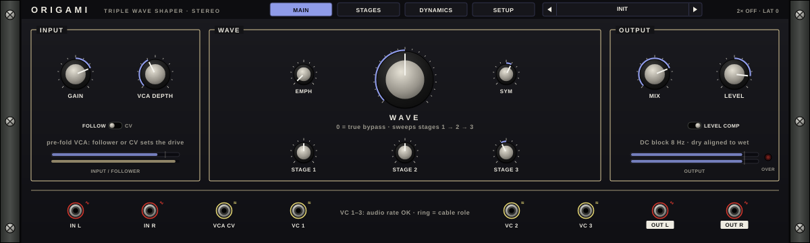
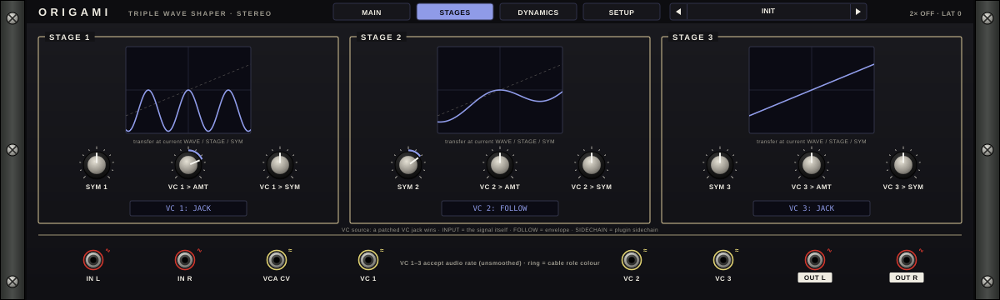
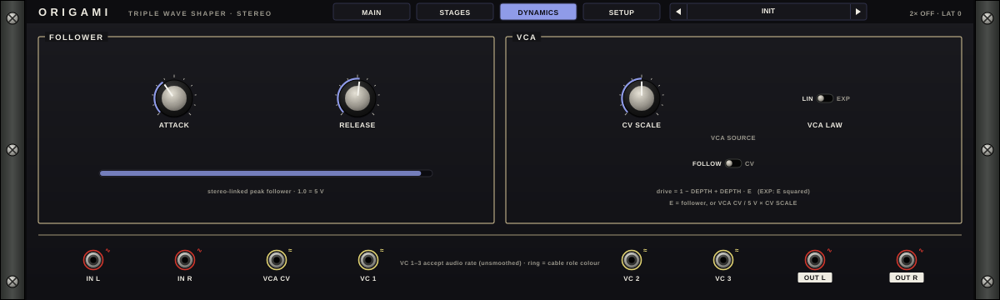
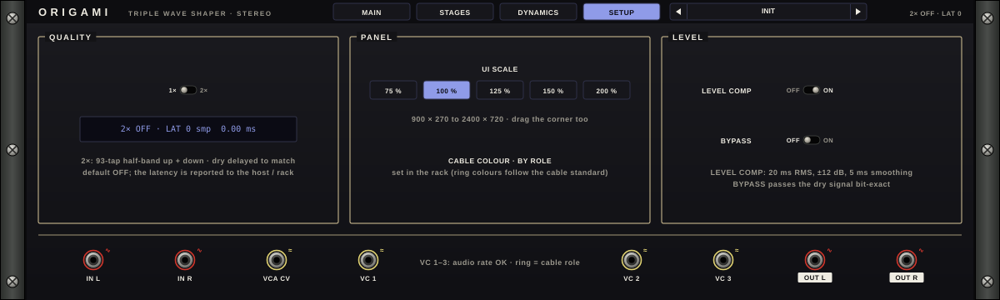
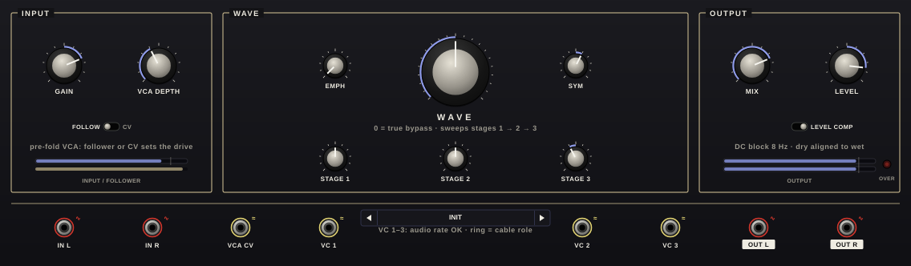
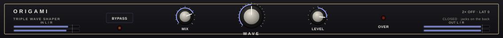
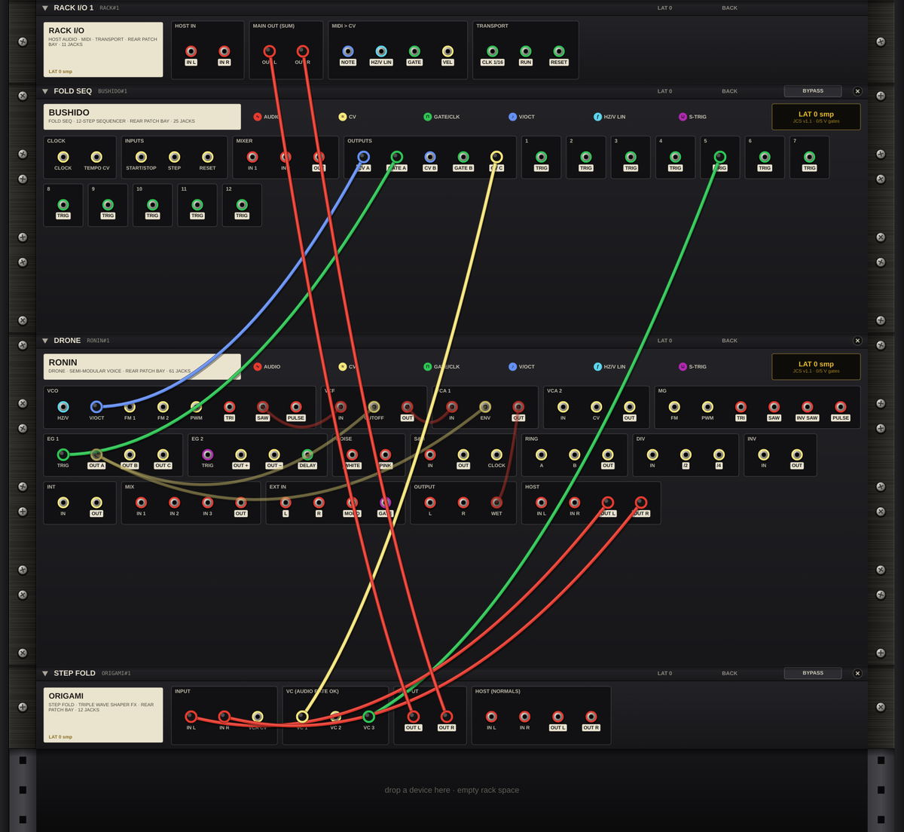

# ORIGAMI User Manual

**Stereo triple wave folder · Jidai Collection · Martial Systems**

---

## Contents

1. Overview
2. Quick start
3. Panel reference
4. Patching
5. MIDI and host sync
6. Factory presets by bank
7. DAW setup
8. Specs
9. Troubleshooting
10. Legal

Appendix: Back panel patching (ORIGAMI in the JIDAI RACK)

---

## 1. Overview

ORIGAMI is a stereo wave folder. A wave folder takes the parts of a waveform that would rise past a limit and folds them back down, so a plain wave turns into one rich in harmonics. ORIGAMI has three folding stages in series under one WAVE knob. Turn WAVE up and stage 1 comes in first, then stage 2, then stage 3. The sound goes from a warm edge to dense, glassy harmonics.

Around the folder are the tools that make it easy to use on real material:

- **GAIN** and a **pre-fold VCA**, so you can set how hard the signal hits the folder, by hand, from an envelope follower or from a control voltage.
- **EMPH** (emphasis), which boosts the highs before the folder and removes exactly that boost after it.
- **SYM** controls that tilt the fold for even harmonics.
- **VC 1, VC 2 and VC 3**, one modulation input per stage, fast enough for audio-rate modulation.
- **LEVEL COMP**, which keeps the output level steady while you sweep WAVE.
- **MIX**, a dry/wet blend in which the dry signal is delayed to line up with the wet one.

At WAVE 0 with the other controls at their defaults, ORIGAMI passes your audio through unchanged, bit for bit.

ORIGAMI runs as a VST3 effect, as a standalone app, and as a device in the JIDAI RACK. In the rack, its jacks patch into the other Jidai devices. Left and right share every control, and the level detectors listen to both channels together, so the stereo image holds.

---

## 2. Quick start

1. Install the plugin (see section 7) and insert ORIGAMI on an audio track or bus.
2. Play some audio through it. With WAVE at 0 you hear the track unchanged.
3. Raise **WAVE** slowly. Below about a third of the way up you are in stage 1, a warm fold. Higher up, stages 2 and 3 join in.
4. Turn **SYM** away from the centre for a lopsided fold with more even harmonics.
5. Turn **MIX** down to blend the folded sound with the dry signal.
6. If the sound is too tame or too wild, adjust **GAIN** on the INPUT side. It sets how hard the signal hits the folder.

To start from a sound designed for your source, click the preset name at the top of the window and pick one from the bank for that source (section 6).

---

## 3. Panel reference

### 3.1 Using the controls

| Action | Result |
|---|---|
| Drag a knob up or down | Changes its value. Hold **Shift** for fine control (5× finer). |
| Mouse wheel over a knob | Small steps. Hold **Shift** for even smaller steps. |
| Double-click a knob | Returns it to its default. |
| Click a switch or selector | Steps to the next position. |
| Right-click a selector | Steps back one position. |
| Click a page tab | Shows that page. |

Every control is a plugin parameter, so your DAW can automate it.

### 3.2 Header

| Element | What it does |
|---|---|
| **MAIN / STAGES / DYNAMICS / SETUP** | Page tabs. |
| **Preset box** | Shows the current factory preset as *BANK · Name*. The arrows step through all presets in order. Click the name for a menu grouped by bank. In the rack, the preset box sits in the jack row, between VC 1 and VC 2. |
| **Status (top right)** | Shows whether 2× quality is on and the current latency in samples, for example `2× OFF · LAT 0`. |

The jack row along the bottom appears on every page (see 3.7).

### 3.3 MAIN page

**INPUT box**

| Control | Range | Default | What it does |
|---|---|---|---|
| **GAIN** | −24 to +12 dB | 0 dB | Input level into the folder. More gain means a deeper fold at any WAVE setting. |
| **VCA DEPTH** | 0–100 % | 0 % | How much the pre-fold VCA moves the drive. At 0 % the VCA does nothing. At 100 % the drive follows the VCA source completely. |
| **FOLLOW / CV** | switch | FOLLOW | The VCA source. FOLLOW uses the envelope follower on the input. CV uses the sidechain follower (when something feeds the sidechain), or in the rack a cable into the VCA CV jack, which wins over the sidechain. The same switch also appears on the DYNAMICS page. |
| Meter | | | Input level, with the follower level underneath. |

The drive into the folder is `1 − DEPTH + DEPTH × E`, where E is the follower or the CV (0 to 1). With VCA LAW set to EXP, E is squared first.

**WAVE box**

| Control | Range | Default | What it does |
|---|---|---|---|
| **WAVE** | 0–100 % | 0 % | The main fold amount. It sweeps stage 1, then stage 2, then stage 3. At 0, with the trims and EMPH also at 0, the folder is bypassed exactly, wherever SYM is set. |
| **EMPH** | 0 to +12 dB | 0 dB | Emphasis: a high shelf (centred at 1 kHz) before the folder and its exact inverse after it. The fold bites harder on bright material while the overall tone stays balanced. |
| **SYM** | −1 to +1 | 0 | Symmetry for all three stages. Off centre, the fold is lopsided and adds even harmonics. |
| **STAGE 1, 2, 3** | −1 to +1 | 0 | Trims that push each stage above or below what WAVE gives it. |

**OUTPUT box**

| Control | Range | Default | What it does |
|---|---|---|---|
| **MIX** | 0–100 % | 100 % | Dry/wet. The dry signal is delayed by the same latency as the wet one, so the blend stays in time. The folding itself trails the dry by a fraction of a sample, up to 1.5 samples at 1× with all three stages folding (a quarter of that at 2×), which only touches the very top end of a blend. |
| **LEVEL** | −36 to +6 dB | 0 dB | Output level. |
| **LEVEL COMP** | off / on | on | Holds the folded signal's loudness close to the input's while you sweep WAVE (20 ms RMS detection, up to ±12 dB, 5 ms smoothing). |
| Meter and **OVER** | | | Output level. OVER lights when the output goes past full scale. |

After the folder, an 8 Hz DC blocker keeps lopsided folds centred.

### 3.4 STAGES page

One box per stage, each with a live display of that stage's transfer curve at the current WAVE, STAGE and SYM settings.

| Control (per stage n = 1, 2, 3) | Range | Default | What it does |
|---|---|---|---|
| **SYM n** | −1 to +1 | 0 | Extra symmetry for this stage, added to the global SYM. |
| **VC n > AMT** | −1 to +1 | 0 | How much the stage's VC source moves its fold amount. Negative values invert. |
| **VC n > SYM** | −1 to +1 | 0 | How much the stage's VC source moves its symmetry. |
| **VC n source** | JACK, INPUT, FOLLOW, SIDECHAIN | JACK | Where the stage's modulation comes from. |

The four VC sources:

- **JACK**: the VC n jack. In the plugin there are no cables, so JACK means no modulation. In the rack, a cable into VC n always wins over the source selector.
- **INPUT**: the input signal itself, after GAIN and the VCA. Left modulates left and right modulates right, which can widen the image.
- **FOLLOW**: the envelope follower (set on the DYNAMICS page).
- **SIDECHAIN**: the sidechain input, summed to mono: in the plugin the sidechain bus, in the rack the SC L/R jacks on the back. Silent when nothing feeds it.

### 3.5 DYNAMICS page

**FOLLOWER box**

| Control | Range | Default | What it does |
|---|---|---|---|
| **ATTACK** | 0.1–50 ms | 1 ms | How fast the follower rises. |
| **RELEASE** | 5–1000 ms | 80 ms | How fast the follower falls. |
| Meter | | | The follower level. 1.0 corresponds to a full-scale input. |

The follower listens to both channels at once and also sets the timing of the plugin's sidechain follower.

**VCA box**

| Control | Range | Default | What it does |
|---|---|---|---|
| **CV SCALE** | 0–2× | 1× | Scales the VCA CV. At 1×, 5 V at VCA CV opens the VCA fully. |
| **VCA LAW** | LIN / EXP | LIN | EXP squares the VCA source for a snappier response. |
| **VCA SOURCE** | FOLLOW / CV | FOLLOW | The same switch as on the MAIN page. |

### 3.6 SETUP page

| Box | Control | What it does |
|---|---|---|
| QUALITY | **1× / 2×** | 1× (default) has no latency and uses anti-aliased folding; the anti-aliasing softens the very top end a little (about 2 dB at 10 kHz for each stage that is folding, at 48 kHz). 2× runs the folder at twice the sample rate for even less aliasing and adds 46 samples of latency, which ORIGAMI reports to your DAW. The display shows the latency in samples and milliseconds. |
| PANEL | **UI SCALE** 75 %, 100 %, 125 %, 150 %, 200 % | Window size. You can also drag the window's corner. In the rack the size follows the rack. |
| PANEL | Cable colour | Information only. In the rack, cable colours follow each jack's signal type. |
| LEVEL | **LEVEL COMP** off/on | The same switch as on the MAIN page. |
| LEVEL | **BYPASS** off/on | Passes the dry signal through bit for bit. At 2× the dry signal is still delayed by 46 samples, so the timing doesn't jump. |

### 3.7 Jack row

| Jack | Signal | What it does |
|---|---|---|
| **IN L**, **IN R** | audio | Audio input. If only IN L is patched, IN R follows it. |
| **VCA CV** | CV, 0–5 V | Sets the pre-fold VCA when VCA SOURCE is CV. |
| **VC 1**, **VC 2**, **VC 3** | CV, audio rate OK | Each stage's modulation input. A cable here wins over the stage's VC source. |
| **OUT L**, **OUT R** | audio | Audio output. |

The ring around each jack shows its signal type: red for audio, yellow for CV. Output jacks have a light label. In the plugin the jacks show what they carry. Hover over one to read it. Cables are patched in the JIDAI RACK (see the appendix).

---

## 4. Patching

### In the plugin

ORIGAMI is a stereo insert effect with one optional extra input:

- **Main input and output**: stereo. A mono input is copied to both sides.
- **Sidechain**: an optional stereo input, off by default. Turn it on in your DAW's routing for the plugin and send another track to it. ORIGAMI then uses the sidechain in two ways:
  - Any stage whose VC source is **SIDECHAIN** is modulated by the sidechain signal.
  - With **VCA SOURCE** on **CV**, a follower on the sidechain (timed by ATTACK and RELEASE) drives the pre-fold VCA. The louder the sidechain, the harder the input is driven into the folder.

Ideas:

- **Drum-triggered fold**: send a kick to the sidechain, set VC 1 source to SIDECHAIN, and raise VC 1 > AMT. Each kick pushes the first stage deeper.
- **Self-modulation**: set a VC source to INPUT. The signal modulates its own fold at audio rate.
- **Dynamic fold**: raise VCA DEPTH with VCA SOURCE on FOLLOW. Loud notes fold deeper than quiet ones.

### In the JIDAI RACK

In the rack every jack in the jack row is live, plus six back-only jacks (see the appendix). Patch audio into IN L/R, CV or audio into VC 1–3 and VCA CV, and take OUT L/R wherever you like. The back-only **SIDECHAIN › SC L/R** jacks are the sidechain input. If you patch both, they are averaged to mono. They work as described above. Signals are exchanged with the other devices sample by sample, so audio-rate modulation from another device works.

---

## 5. MIDI and host sync

ORIGAMI doesn't use MIDI notes or the host tempo. It responds the same way at any tempo.

- **Automation**: every control is a host parameter.
- **Programs**: the factory presets appear in your DAW's program list as *BANK: Name* (for example `RONIN: Acid Grit`). Choosing a program loads that preset.
- **Latency**: at QUALITY 2×, ORIGAMI reports 46 samples to the host, so your DAW's delay compensation keeps it in time with other tracks.
- **Saved state**: your DAW project stores every setting. The plugin and the rack device use the same state format, so settings move between them.

---

## 6. Factory presets by bank

There are 33 presets in five banks. Click the preset name in the header for a menu grouped by bank, or step through all of them with the arrows. Every preset has LEVEL COMP on and was checked to stay below full scale on test material. Presets are built into the plugin and the JIDAI RACK, so nothing needs installing. In the rack, the same presets are in the preset box in ORIGAMI's jack row.

The banks are voiced for the other Jidai instruments, but any preset works on any source.

### INIT

| Preset | Description |
|---|---|
| INIT | Every control at its default. True bypass. Start here to build your own. |

### RONIN: basses and leads from a synth voice

| Preset | Description |
|---|---|
| Acid Grit | Medium fold with emphasis and a little symmetry, at 2× quality. A gritty edge for resonant bass lines. |
| Acid Squelch Fold | Light fold that the envelope follower pushes deeper on every note (VC 1 from FOLLOW). |
| Reese Growl | Strong lopsided fold with stage 2 nudged up, output lowered. For detuned, growling basses. |
| Wavefolded Bass | Medium fold with stages 2 and 3 held back, 80 % wet. Fat but controlled. |
| Lead Bite | Medium fold with strong emphasis, so the fold bites on bright leads. |
| Pluck Edge | Light fold with the VCA and stage 1 following the envelope. The fold opens on each attack. |
| Hard Sync-Style Lead | Deep fold with heavy emphasis at 2× quality, for tearing lead tones. |
| Sub-Safe Bass Drive | Light fold with stage 3 pulled back, 60 % wet. Adds drive and keeps the low end clean. |

### SHOGUN: drums and drum buses

| Preset | Description |
|---|---|
| Drum Smash | Deep fold with extra gain and emphasis, 70 % wet, output lowered. Crushed drums. |
| Kick Fold | Stage 1 follows a fast envelope, so each kick folds as it hits. 60 % wet. |
| Hat Sizzle | Full emphasis and a medium fold at 2× quality, 50 % wet. Adds sizzle to hats and cymbals. |
| Drum-Bus Glue | Gentle fold, 80 % wet. Thickens a whole drum bus. |
| Snare Crack | Emphasis plus stage 2 following a very fast envelope. Adds crack to snares. |
| Transient Fold | The VCA follows a fast envelope, so transients fold harder than the tails. 50 % wet. |
| Tom Bloom | Asymmetric fold, with stage 1 following a slow-release envelope. Toms bloom as they ring. |
| Parallel Drum Grit | Medium fold mixed in at 35 % for parallel grit. |

### BUSHIDO: folds sequenced from a step sequencer

In this bank VC 1–3 are set to JACK, with depths chosen for a 0–5 V sequencer row. Unpatched, each preset is a moderate fold. In the rack, patch a sequencer's CV outputs into VC 1–3.

| Preset | Description |
|---|---|
| Stepped Fold Sequence | Light fold. VC 1, 2 and 3 each move one stage's amount. |
| Stepped Symmetry | Medium fold. VC 1 and VC 2 move the symmetry of stages 1 and 2 in opposite directions. |
| Row C Fold Accent | Light fold. VC 3 makes a strong change to stage 3, good for accents from one row. |
| Pitch-Tracked Fold | Light fold. VC 1 and VC 2 make small changes, so a pitch CV makes higher notes fold a little more. |
| Fold Arpeggio | Very light fold with emphasis. VC 1 moves stage 1 a lot, and VC 2 moves stage 2's symmetry. |
| Gate-Opened Fold | Medium fold with VCA SOURCE on CV. A gate or envelope on VCA CV drives the folder harder while it is high. |
| Stepped Bite | Medium fold with emphasis. VC 1 moves stage 1, and VC 3 moves stage 3's symmetry. |

### GENERIC: any source, buses and mixes

| Preset | Description |
|---|---|
| Warm Bus Glue | Very gentle, slightly asymmetric fold. Subtle warmth on buses. |
| Analog Edge | Light asymmetric fold with a little emphasis, 60 % wet. |
| Even-Order Bloom | Strongly asymmetric fold, 75 % wet. Rich even harmonics. |
| Lopsided Fold | Strongly asymmetric fold with extra symmetry on stage 1, output lowered. |
| Self-Modulated Fold | Stage 1 is modulated by the input itself at audio rate. |
| Stereo Shimmer Fold | Stages 2 and 3 are modulated by each channel's own signal, at 2× quality. A wider image. |
| Sidechain Pump Fold | Stages 1 and 2 follow the sidechain. Feed a kick or another rhythm to the sidechain. Without one, a plain light fold. |
| Full Fold | WAVE fully up with all three stages pushed, at 2× quality, output lowered. |
| Shattered | Extreme: full fold, maximum gain and emphasis, heavy asymmetry and self-modulation, output well down. |

---

## 7. DAW setup

ORIGAMI is a VST3 audio effect. You can also run it as a standalone app.

### Installing

Copy `ORIGAMI.vst3` into your system's VST3 folder:

| System | VST3 folder |
|---|---|
| macOS | `~/Library/Audio/Plug-Ins/VST3/` (just you) or `/Library/Audio/Plug-Ins/VST3/` (all users) |
| Windows | `C:\Program Files\Common Files\VST3\` |
| Linux | `~/.vst3/` |

Then have your DAW rescan its plugins. ORIGAMI is listed under **Martial Systems**.

### Using it in any DAW

1. Insert ORIGAMI as an effect on an audio track, instrument track or bus.
2. To use the sidechain, enable the plugin's sidechain input in your DAW's routing and send the trigger track to it.
3. Automate any control from your DAW's automation lanes.
4. Leave the DAW's plugin delay compensation on if you use QUALITY 2×.

### Example: FL Studio

1. Close FL Studio, copy the VST3 into your VST3 folder, and open FL Studio.
2. Open **Options › Manage plugins** and click **Find installed plugins**. Mark ORIGAMI as a favourite if you like.
3. In the **Mixer**, select the insert track you want, click an empty effect slot and choose ORIGAMI.
4. For a sidechain, route the trigger track to this insert with a sidechain send, then pick it as the plugin's sidechain input in the plugin wrapper's settings.
5. ORIGAMI reports its 2× latency to FL Studio, whose plugin delay compensation uses it.

### Standalone

The standalone app opens your default audio input and output. Choose devices in its audio settings.

---

## 8. Specs

| | |
|---|---|
| Type | Stereo triple wave folder (three stages in series) |
| Formats | VST3 effect and standalone app |
| Channels | Stereo in/out (mono input is copied to both sides), plus an optional stereo sidechain input |
| Stereo | Left and right share every control. Follower and LEVEL COMP listen to both channels. |
| Signal chain | GAIN › pre-fold VCA › emphasis › stage 1 › 2 › 3 › de-emphasis › DC block (8 Hz) › LEVEL COMP › MIX (dry aligned) › LEVEL |
| Quality | 1×: anti-aliased folding, 0 samples latency. 2×: oversampled, 46 samples latency, reported to the host. |
| True bypass | WAVE 0 with the other controls at their defaults, or BYPASS on: output is bit-identical to input |
| Parameters | 30, all automatable |
| Factory presets | 33 in 5 banks |
| Pages | MAIN, STAGES, DYNAMICS, SETUP |
| UI | 75 % to 200 % scale, freely resizable |
| Rack device | 3 U open, 1 U closed. 8 front jacks plus 6 back-only jacks. 0 or 46 samples latency, compensated by the rack. |
| Signal levels (rack) | Audio ±5 V (full scale). VCA CV 0–5 V. VC inputs accept audio-rate signals. |
| Consistency | Built so that every supported system computes the same samples from the same settings |

---

## 9. Troubleshooting

| Problem | What to check |
|---|---|
| No change in the sound | WAVE is at 0 and the other controls are at their defaults, which is true bypass. Raise WAVE. Also check that BYPASS (SETUP page) is off. |
| Too loud or clipping (OVER lit) | Lower LEVEL or GAIN. Turn LEVEL COMP on. Extreme presets (Shattered, Full Fold) already lower the output. Lower it more for loud sources. |
| The fold gets quieter as I turn WAVE up | That is LEVEL COMP holding the level steady. Turn it off for the raw level change. |
| VC knobs do nothing | Check the stage's VC source on the STAGES page. JACK needs a cable (rack only). SIDECHAIN needs a signal on the plugin's sidechain input. |
| VCA SOURCE CV does nothing | In the plugin it needs a sidechain signal. In the rack it needs a cable into VCA CV. Also check that VCA DEPTH is above 0. |
| Track is late against others at 2× | Turn on plugin delay compensation in your DAW. ORIGAMI reports its 46 samples. |
| Harsh high end | Try QUALITY 2×, lower EMPH, or bring MIX down. |
| Plugin not listed | Check the VST3 folder (section 7) and rescan in your DAW. |
| Lopsided waveform or offset | The 8 Hz DC blocker removes offset after the folder. Very low frequencies under heavy SYM still change shape. That is the fold itself. |

---

## 10. Legal

Copyright © 2026 Martial Systems LLC. All rights reserved.

ORIGAMI, JIDAI RACK and the Jidai Collection are products of Martial Systems LLC. All other trademarks belong to their owners. See the LICENSE file that comes with ORIGAMI for the full terms.

---

## Appendix: Back panel patching (ORIGAMI in the JIDAI RACK)

In the JIDAI RACK, ORIGAMI is a 3 U device when open and a 1 U strip when closed. Press **Tab** (or click **BACK** in the rack header) to flip the whole rack around. On the back, ORIGAMI is a 1 U rear plate that carries all 14 of its jacks.

### Rear jacks

| Group | Jack | Direction | Signal | Notes |
|---|---|---|---|---|
| INPUT | IN L | in | audio | |
| INPUT | IN R | in | audio | Follows IN L when only IN L is patched |
| INPUT | VCA CV | in | CV | 0–5 V, used when VCA SOURCE is CV |
| VC (AUDIO RATE OK) | VC 1, VC 2, VC 3 | in | CV | A cable here wins over the stage's VC source |
| OUTPUT | OUT L, OUT R | out | audio | |
| HOST (NORMALS) | IN L, IN R | in | audio | Back only. Feeds IN L/R while those are unpatched. |
| HOST (NORMALS) | OUT L, OUT R | out | audio | Back only. The same signal as OUT L/R. |
| SIDECHAIN | SC L, SC R | in | audio | Back only. The sidechain input, averaged to mono when both are patched. |

### Colours and labels

Each jack's ring shows its signal type, and cables take the colour of the jack they come from:

| Colour | Signal |
|---|---|
| Red | Audio |
| Yellow | CV |
| Green | Gate / clock |
| Blue | 1 V/oct pitch |
| Light blue | Linear Hz/V pitch |
| Purple | S-trigger |

Output jacks have a light label. Inputs have a plain label.

### Normalled connections

- **IN R ← IN L**: with only IN L patched, both channels get the IN L signal.
- **HOST IN ← into IN L/R**: while IN L/R are unpatched, the back-only HOST IN jacks feed them. Patch the rack's host audio (RACK I/O › HOST IN) into ORIGAMI's HOST IN to process your track while keeping IN L/R free for other sources.
- **OUT ← HOST OUT**: HOST OUT L/R always carry the same signal as OUT L/R, so you can send the output to two places from tidy positions on the plate.
- When you add an ORIGAMI to a rack, the rack patches it for you on the back-only jacks: RACK I/O › HOST IN L/R into ORIGAMI's HOST IN L/R, and ORIGAMI's HOST OUT L/R into RACK I/O › MAIN OUT L/R. IN L/R and OUT L/R stay free. Hold **Shift** while adding to place it without cables.

### Cable views

Press **K** to cycle the cable views. The rack header shows which one is lit: **ALL** (every cable as a rope), **HIDE PASS-THRU** (long cables become short stubs tagged with their far end), **SELECTED** (the selected device's cables at full strength) and **HIDE** (plugs only). The rack manual covers patching gestures in full.

### Worked example: Stepped Fold (starter rack)

Open the rack's **RACKS** menu and choose **EDM › Stepped Fold**, then press Tab.

The rack has the cables shown above:

1. **RONIN › HOST OUT L / HOST OUT R → ORIGAMI IN L / IN R** (red): RONIN's output, a saw drone gated by BUSHIDO, into the folder.
2. **BUSHIDO › CV C → ORIGAMI VC 1** (yellow): row C of the sequencer sets stage 1's fold for every step.
3. **BUSHIDO › step 5 TRIG → ORIGAMI VC 3** (green): once per loop a trigger kicks stage 3.
4. **ORIGAMI › OUT L / OUT R → RACK I/O › MAIN OUT L / R**: to your DAW.

Try moving the VC 1 cable to VC 2, or patching **RONIN › MG TRI** into **VCA CV** with VCA SOURCE on CV for a slow, breathing drive.

### Worked example: Filter Fold FX (starter rack)

**FX › Filter Fold FX** runs your track through RONIN's resonant filter, swept by its MG, and then through ORIGAMI: RACK I/O › HOST IN L/R → RONIN › HOST IN L/R (back only, feeds RONIN's EXT IN) → EXT IN MONO → VCF → VCA 1 → OUTPUT WET → RONIN › HOST OUT L/R → ORIGAMI › IN L/R → ORIGAMI › OUT L/R → RACK I/O › MAIN OUT L/R. Insert JIDAI RACK on an audio track to hear it.
